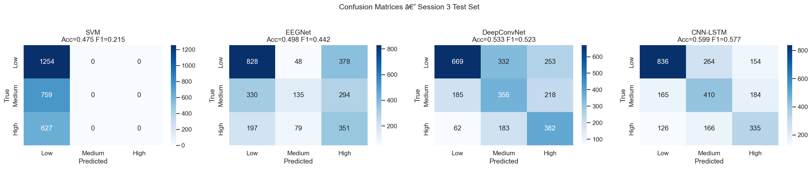
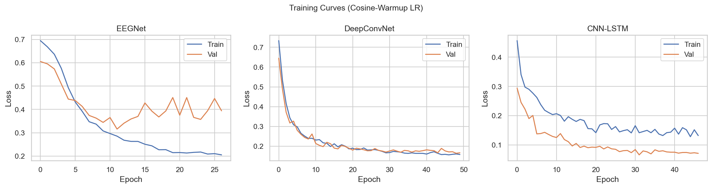

# EEG Mental Workload Classification

> 📄 **Paper:** [Cross-Session EEG Mental Workload Classification (PDF)](Cross-Session%20EEG%20Mental%20Workload%20Classification.pdf) — full write-up of methodology, results, and discussion.

Deep-learning pipeline for **cross-session 3-class mental workload classification** from EEG. Trained on the publicly available COG-BCI MATB dataset — 29 subjects performing the Multi-Attribute Task Battery at Low / Medium / High workload across three sessions.

The hard part is **cross-session generalisation**: train on sessions 1 + 2, test on session 3. EEG is highly non-stationary across sessions (electrode drift, impedance changes, cognitive adaptation), so this is a domain-shift problem on top of a classification problem.

## Results

| Model                       | Accuracy   | Macro-F1   | Low-F1 | Medium-F1 | High-F1 |
| --------------------------- | ---------- | ---------- | ------ | --------- | ------- |
| SVM (band-power features)   | 0.475      | 0.215      | 0.64   | 0.00      | 0.00    |
| EEGNet                      | 0.498      | 0.441      | 0.63   | 0.26      | 0.43    |
| DeepConvNet                 | 0.533      | 0.523      | 0.62   | 0.44      | 0.52    |
| **CNN-LSTM (best single)**  | **0.599**  | **0.577**  | 0.70   | 0.51      | 0.52    |
| **Ensemble (DCN + LSTM)**   | 0.590      | **0.578**  | 0.68   | 0.50      | **0.56**|

Test set: 2,640 windows from session S3 (29 subjects × 3 difficulty levels).




## What this project demonstrates

- **End-to-end EEG pipeline** — bad-channel detection / interpolation, CAR re-referencing, 1–45 Hz bandpass, artefact rejection, z-score normalisation
- **Multiple deep architectures** — SVM baseline, EEGNet, DeepConvNet, custom **multi-scale CNN-LSTM** with parallel branches for theta / alpha / beta rhythms
- **Domain adaptation** — per-session Euclidean Alignment (EA) and CORAL feature alignment to fight cross-session non-stationarity
- **Foundation-model fine-tuning** — two-stage linear-probe-then-full fine-tuning of [CBraMod (ICLR 2025)](https://arxiv.org/abs/2412.07236) for comparison against from-scratch models
- **Methodical experimentation** — Tier 1 baselines → Tier 2 (8s windows, multi-scale CNN-LSTM, per-session EA, AdamW, CORAL) yielding **+4.3 pp accuracy / +11.6 pp Medium-F1** over the baseline

Full methodology and findings: [docs/project_report.md](docs/project_report.md).

## Project structure

```text
.
├── notebooks/
│   ├── EDA_MATB.ipynb                 # exploratory analysis
│   ├── eeg_workload_implementation.ipynb  # preprocessing + Tier 1 models
│   ├── eeg_workload_final.ipynb       # canonical Tier 2 final model
│   └── cbramod_experiment.ipynb       # CBraMod foundation-model fine-tuning
├── results/
│   ├── final_confusion_matrices.png
│   └── training_curves.png
├── docs/                              # full report and experiment write-ups
│   ├── project_report.md              # canonical write-up
│   ├── eda_findings.md
│   ├── experiment_review.md
│   ├── implementation_plan.md
│   ├── project_plan.md
│   ├── tier1_analysis.md
│   └── final_project_document.md
├── requirements.txt
└── LICENSE
```

## How to run

```bash
python -m venv venv
source venv/bin/activate          # Windows: .\venv\Scripts\Activate.ps1
pip install -r requirements.txt
jupyter lab
```

Then open `notebooks/eeg_workload_final.ipynb`. The notebook downloads and preprocesses the COG-BCI MATB recordings on first run; this takes ~30 minutes on a CPU and benefits significantly from a GPU for the deep-learning models.

## Key references

- EEGNet — Lawhern et al., *J. Neural Eng.*, 2018
- DeepConvNet — Schirrmeister et al., *Human Brain Mapping*, 2017
- CBraMod — Wang et al., *ICLR*, 2025
- Euclidean Alignment — He & Wu, *IEEE T-BME*, 2020

## License

MIT — see [LICENSE](LICENSE).
